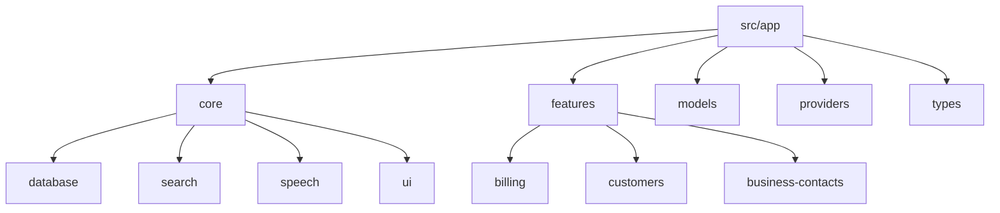
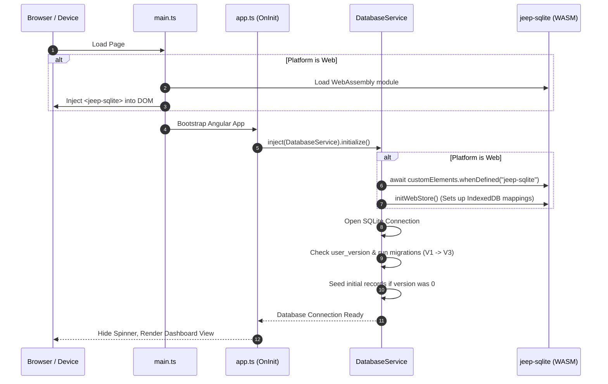

# Codebase Architecture & Technical Structure

This document describes the architectural layout, technology stack, bootstrap lifecycle, and core reactive components of the Hardware Store ERP system.

---

## 🛠️ Technology Stack

The application is built on top of a modern, lightweight, hybrid-ready web architecture:

1.  **Frontend Framework:** Angular v22.0.0+ utilizing Standalone Components, reactive Signals for state, Injection functions (`inject()`), and native control flow (`@if`, `@for`).
2.  **Database Storage:** SQLite powered by `@capacitor-community/sqlite` and `@capacitor/core` for hybrid desktop/mobile deployments.
3.  **Browser Persistence Fallback:** `jeep-sqlite` WASM engine saving state to browser IndexedDB store for web-only environments.
4.  **Styling & UI Components:** Bootstrap v5.3.8 for responsive layouts, form grids, print layouts, and dashboard tables.
5.  **Voice Recognition:** HTML5 Web Speech API (`SpeechRecognition` / `webkitSpeechRecognition`) wrapped natively inside Angular services.

---

## 📁 Directory Structure Breakdown

The codebase follows a modular clean-architecture layout under the `/src/app` root directory:



### Module Descriptions and Key Files

*   **`core/`**: Shared services and infrastructures that underpin the application:
    *   **`database/`**: Configures the connection, migration engine, and seeding routines.
        *   [`database.ts`](file:///Users/smitpatel/Desktop/Personal%20Projects/voice-to-text/src/app/core/database/database.ts): Singleton connection manager orchestrating schema builds.
        *   [`repositories/`](file:///Users/smitpatel/Desktop/Personal%20Projects/voice-to-text/src/app/core/database/repositories): Direct query tables interfaces (e.g. `customer.repository.ts`, `product.ts`).
    *   **`search/`**: Extensible product fuzzy search engine.
        *   [`product-search.service.ts`](file:///Users/smitpatel/Desktop/Personal%20Projects/voice-to-text/src/app/core/search/services/product-search.service.ts): In-memory keywords indexes, scoring pipeline registry, and ranking routines.
    *   **`speech/`**: Speech to text providers.
        *   [`speech.ts`](file:///Users/smitpatel/Desktop/Personal%20Projects/voice-to-text/src/app/core/speech/services/speech.ts): Coordinates active speech recognition sessions.
        *   [`browser-speech-provider.ts`](file:///Users/smitpatel/Desktop/Personal%20Projects/voice-to-text/src/app/core/speech/providers/browser-speech-provider.ts): Low-level event mappings for standard browser Web Speech APIs.
    *   **`ui/`**: Core reusable overlays.
        *   [`toast/`](file:///Users/smitpatel/Desktop/Personal%20Projects/voice-to-text/src/app/core/ui/toast): Reactive toast notifications.
        *   [`confirmation-dialog/`](file:///Users/smitpatel/Desktop/Personal%20Projects/voice-to-text/src/app/core/ui/confirmation-dialog): Modal confirms service hook.
*   **`features/`**: Independent functional domains:
    *   **`billing/`**: The invoice builder form, split-screen PDF preview card, calculations logic, and print handlers.
    *   **`customers/`**: Operations relating to client profiles, notes, and sub-contact worker lists.
    *   **`business-contacts/`**: Operations managing plumbers, contractors, roles, and billing assignments.

---

## 🔄 Bootstrap Lifecycle & Web SQLite Fallback

Since SQLite is a native C-library and browsers do not support it natively, the application uses a dynamic bootstrapping pattern in [`main.ts`](file:///Users/smitpatel/Desktop/Personal%20Projects/voice-to-text/src/main.ts) and the root Component [`app.ts`](file:///Users/smitpatel/Desktop/Personal%20Projects/voice-to-text/src/app/app.ts):

### Sequence Flow of Startup



1.  **DOM Custom Elements Loader:** On web platforms, [`main.ts`](file:///Users/smitpatel/Desktop/Personal%20Projects/voice-to-text/src/main.ts) calls `jeepSqlite(window)` to define custom elements, creates a `<jeep-sqlite>` HTML element, and appends it to `document.body` before Angular bootstraps.
2.  **Angular Initialization:** Angular builds the injection context. The root [`App`](file:///Users/smitpatel/Desktop/Personal%20Projects/voice-to-text/src/app/app.ts) component starts `ngOnInit()`, displaying a loading spinner.
3.  **Database Connection Pooling:** [`DatabaseService`](file:///Users/smitpatel/Desktop/Personal%20Projects/voice-to-text/src/app/core/database/database.ts) opens a connection. On the web platform, it calls `initWebStore()`, mapping virtual files to local IndexedDB databases.
4.  **Schema Verification:** The connection version is checked. Sequentially, pending migrations are loaded, and if it's a fresh database, seeds are injected.
5.  **State Unlock:** Once completed, the `isDbReady` signal is set to `true`, switching the template view from the loader screen to the router dashboard navigation.

---

## 📡 Core UI Services (Global Overlays)

To avoid duplicating dialog layouts and toast systems, the application employs global reactive overlays triggered by singleton services:

### 1. Toast Notification Overlay
*   **Service:** [`toast.service.ts`](file:///Users/smitpatel/Desktop/Personal%20Projects/voice-to-text/src/app/core/ui/toast/toast.service.ts)
*   **Component:** [`toast.component.ts`](file:///Users/smitpatel/Desktop/Personal%20Projects/voice-to-text/src/app/core/ui/toast/toast.component.ts)
*   **Mechanism:** Exposes a readonly Signal array of active toasts. Calling `showSuccess(message)`, `showError(message)`, or `showInfo(message)` updates the signal list. The global template rendering at the bottom of [`app.html`](file:///Users/smitpatel/Desktop/Personal%20Projects/voice-to-text/src/app/app.html) fades in matching cards, auto-dismissing them after a timeout.

### 2. Confirmation Overlays
*   **Service:** [`confirmation-dialog.service.ts`](file:///Users/smitpatel/Desktop/Personal%20Projects/voice-to-text/src/app/core/ui/confirmation-dialog/confirmation-dialog.service.ts)
*   **Component:** [`confirmation-dialog.component.ts`](file:///Users/smitpatel/Desktop/Personal%20Projects/voice-to-text/src/app/core/ui/confirmation-dialog/confirmation-dialog.component.ts)
*   **Mechanism:** Exposes a Promise-based callback. Triggering `confirm({title, message})` pushes settings to an overlay state and returns a `Promise<boolean>`. The global modal block traps focus and resolves the promise on "Yes" / "Cancel" clicks, letting features implement confirmations using `await`:
    ```typescript
    const confirmed = await this.confirmService.confirm({
      title: 'Delete Customer?',
      message: 'Are you sure you want to remove this record?'
    });
    if (confirmed) { ... }
    ```
