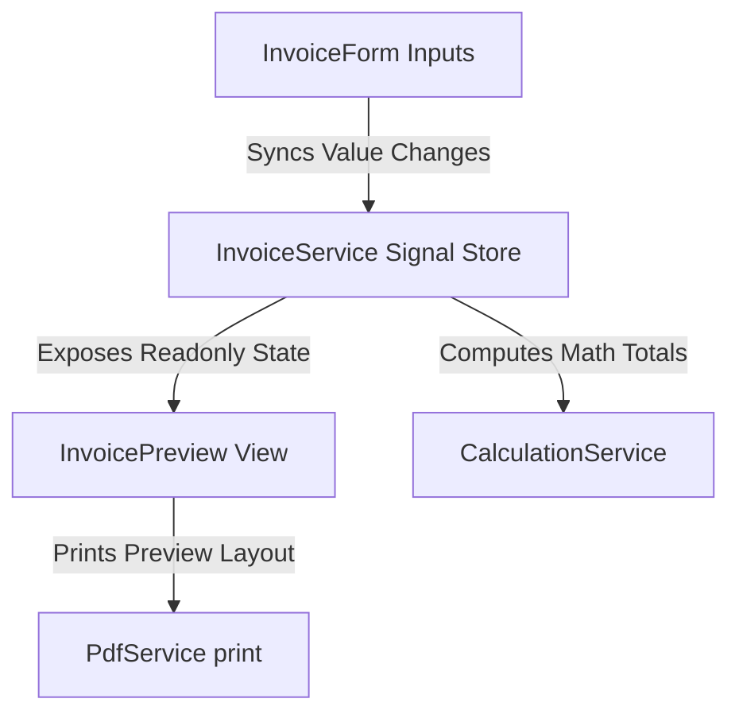

# Core Features & Modules Catalog

This document details the functionality, routing, business logic rules, and components of the five main application features.

---

## 1. 🧾 A4 Invoice Generator (Billing Module)

The Invoice Generator is the core feature of the ERP system. It features a responsive side-by-side workspace:
*   **Left Hand Side:** Reactive Invoice Form input fields.
*   **Right Hand Side (Sticky):** Styled A4 invoice preview matching real-time inputs.

### Technical Specs
*   **Route:** `/billing` (Default entry route)
*   **Main Container:** [`BillingPage`](file:///Users/smitpatel/Desktop/Personal%20Projects/voice-to-text/src/app/features/billing/pages/billing-page/billing-page.ts)
*   **Form Controller:** [`InvoiceForm`](file:///Users/smitpatel/Desktop/Personal%20Projects/voice-to-text/src/app/features/billing/components/invoice-form/invoice-form.ts)
*   **Preview Render:** [`InvoicePreview`](file:///Users/smitpatel/Desktop/Personal%20Projects/voice-to-text/src/app/features/billing/components/invoice-preview/invoice-preview.ts)
*   **Calculations Logic:** [`CalculationService`](file:///Users/smitpatel/Desktop/Personal%20Projects/voice-to-text/src/app/features/billing/services/calculation.service.ts)
*   **Printing Layout:** [`PdfService`](file:///Users/smitpatel/Desktop/Personal%20Projects/voice-to-text/src/app/features/billing/services/pdf.service.ts)

### Core Workflows

1.  **Dual Billing Modes (Toggle):**
    *   **Customer Billing:** Requires Customer Name (with auto-lookup), Mobile Number (validated 10-digits), Billing Address, and a "Purchased By" selector. If the customer has registered contacts (workers/relatives), the dropdown allows choosing who collected the items.
    *   **Business Contact Billing:** Geared towards independent contractors. The mobile number becomes optional, and billing is registered directly to a professional from the business contacts pool.
2.  **Voice-Assisted Item Rows:** Each row in the items table contains a microphone trigger. Clicking it starts local speech recognition. The spoken string (e.g. *"5 bags of Ashirvad cement"*) is parsed, identifying the quantity (`5`), standard unit (`Bag`), and search term (*"Ashirvad cement"*). It searches the database, auto-populates the matching product details, rate, and calculates the total row amount.
3.  **Invoice Calculations Formula:**
    $$\text{Subtotal} = \sum (\text{Quantity} \times \text{Rate})$$
    $$\text{Taxable Amount} = \text{Subtotal} - \text{Discount}$$
    $$\text{GST (18.0\%)} = \text{Taxable Amount} \times 0.18$$
    $$\text{Grand Total} = \text{Taxable Amount} + \text{GST}$$
    $$\text{Round Off} = \text{Math.round(Grand Total)} - \text{Grand Total}$$
    *The rounding offsets are calculated to produce a clean integer invoice total.*
4.  **Print Styling Layout:** When calling `printInvoice()` on [`PdfService`](file:///Users/smitpatel/Desktop/Personal%20Projects/voice-to-text/src/app/features/billing/services/pdf.service.ts), the browser print engine is invoked. Global CSS styles apply `@media print` directives to hide all dashboard navigation, sidebar panels, input fields, and action buttons, mapping *only* the invoice A4 preview wrapper to the printable page sheet.

---

## 2. 👥 Customer Management

The Customer module manages profile directories, contact information, and billing relationships.

### Technical Specs
*   **Routes:**
    *   List view: `/customers`
    *   New form: `/customers/new`
    *   Details profile: `/customers/:id`
    *   Edit form: `/customers/:id/edit`
*   **List Page:** [`CustomerListComponent`](file:///Users/smitpatel/Desktop/Personal%20Projects/voice-to-text/src/app/features/customers/pages/customer-list/customer-list.component.ts)
*   **Form Component:** [`CustomerFormComponent`](file:///Users/smitpatel/Desktop/Personal%20Projects/voice-to-text/src/app/features/customers/pages/customer-form/customer-form.component.ts)
*   **Details Profile Page:** [`CustomerDetailsComponent`](file:///Users/smitpatel/Desktop/Personal%20Projects/voice-to-text/src/app/features/customers/pages/customer-details/customer-details.component.ts)
*   **Repository Repository:** [`CustomerRepository`](file:///Users/smitpatel/Desktop/Personal%20Projects/voice-to-text/src/app/core/database/repositories/customer.repository.ts)
*   **Data Service:** [`CustomerService`](file:///Users/smitpatel/Desktop/Personal%20Projects/voice-to-text/src/app/features/customers/services/customer.service.ts)

### Core Workflows
1.  **Associated Workers (One-to-Many):** Each customer profile can list associated contacts (workers, purchase agents, or site foremen). These records are kept in `customer_contacts` mapping back to the `customers` database primary key.
2.  **ERP Autocomplete Sync:** When typing inside the invoice customer search field, a background effect triggers `customerService.searchCustomer(query)`. If matching records are found, they pop up in a dropdown card. Selecting a profile auto-fills the mobile, address, company name, and loads their workers into the "Purchased By" selector.

---

## 3. 👔 Business Contacts

Designed to track business relationships with field professionals (plumbers, electricians, and carpenters) who buy materials or recommend the store to clients.

### Technical Specs
*   **Routes:**
    *   List view: `/business-contacts`
    *   Roles view: `/business-contacts/roles`
    *   New form: `/business-contacts/new`
    *   Details view: `/business-contacts/:id`
    *   Edit form: `/business-contacts/:id/edit`
*   **List Page:** [`ContactListComponent`](file:///Users/smitpatel/Desktop/Personal%20Projects/voice-to-text/src/app/features/business-contacts/pages/contact-list/contact-list.component.ts)
*   **Form Component:** [`ContactFormComponent`](file:///Users/smitpatel/Desktop/Personal%20Projects/voice-to-text/src/app/features/business-contacts/pages/contact-form/contact-form.component.ts)
*   **Details Page:** [`ContactDetailsComponent`](file:///Users/smitpatel/Desktop/Personal%20Projects/voice-to-text/src/app/features/business-contacts/pages/contact-details/contact-details.component.ts)
*   **Roles Page:** [`RoleListComponent`](file:///Users/smitpatel/Desktop/Personal%20Projects/voice-to-text/src/app/features/business-contacts/pages/role-list/role-list.component.ts)
*   **Repository Repository:** [`BusinessContactRepository`](file:///Users/smitpatel/Desktop/Personal%20Projects/voice-to-text/src/app/core/database/repositories/business-contact.repository.ts)
*   **Data Service:** [`BusinessContactService`](file:///Users/smitpatel/Desktop/Personal%20Projects/voice-to-text/src/app/features/business-contacts/services/business-contact.service.ts)

### Core Workflows
1.  **Multiple Professional Roles (Many-to-Many):** A contact can possess multiple skills (e.g. Plumber and Contractor). Mappings are handled in the junction table `business_contact_role_map` tying contact IDs to role IDs.
2.  **Role Administration Interface:** In `/business-contacts/roles`, developers or users can add new professions, set ordering priorities, or toggle status values (active/inactive).

---

## 4. 🎙️ Voice Assistant Demo

Provides an experimental workbench interface for checking microphone compatibility, reviewing transcripts, and switching language algorithms.

### Technical Specs
*   **Route:** `/speech`
*   **Main Component:** [`SpeechDemo`](file:///Users/smitpatel/Desktop/Personal%20Projects/voice-to-text/src/app/core/speech/components/speech-demo/speech-demo.ts)
*   **Service Engine:** [`SpeechService`](file:///Users/smitpatel/Desktop/Personal%20Projects/voice-to-text/src/app/core/speech/services/speech.ts)

### Core Workflows
1.  **State Toggles:** Buttons allow calling `start()`, `stop()`, `abort()`, or `reset()` on the engine.
2.  **Environment Check:** Automatically flags whether the client browser supports web speech APIs, displaying warning banners if unsupported.
3.  **Language Configuration:** Dropdown binds `speechService.setLanguage(lang)` to allow testing recognition accuracy across standard English (`en-US`), Gujarati (`gu-IN`), Hindi (`hi-IN`), or hybrid models.

---

## 5. 🗄️ Database CRUD Manager

An advanced tool panel that exposes the SQLite schema tables and allows executing custom statements directly in the app.

### Technical Specs
*   **Route:** `/database`
*   **Main Component:** [`DatabaseDemo`](file:///Users/smitpatel/Desktop/Personal%20Projects/voice-to-text/src/app/core/database/components/database-demo/database-demo.ts)
*   **Core Injection:** [`DatabaseService`](file:///Users/smitpatel/Desktop/Personal%20Projects/voice-to-text/src/app/core/database/database.ts)

### Core Workflows
1.  **Direct Table View: ** Displays row summaries for every table in the SQLite file.
2.  **Console Terminal: ** Input field allowing raw SQL queries (e.g. `SELECT * FROM Product WHERE CategoryId = 1`). On submission, query outputs are rendered in tables, and writes return affected row counts.
3.  **Database Seeding Console:** Buttons to clear all tables and run seed routines on demand.
