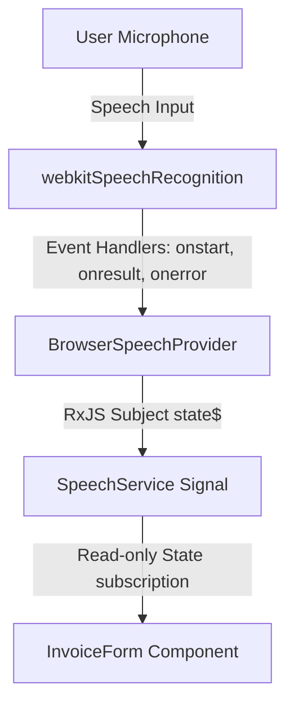

# Voice Recognition & Product Search Pipelines

This document details the speech-to-text data flow, phonetic string normalization, and the fuzzy-logic product search matching pipeline that powers the ERP system's voice-assisted billing.

---

## 🎙️ Voice Recognition Pipeline

Voice inputs are captured from the user's microphone and streamed through Angular services using standard Web Speech interfaces:



### Components

1.  **Low-Level Wrapper ([`BrowserSpeechProvider`](file:///Users/smitpatel/Desktop/Personal%20Projects/voice-to-text/src/app/core/speech/providers/browser-speech-provider.ts)):**
    *   Interfaces directly with `window.SpeechRecognition` or `window.webkitSpeechRecognition`.
    *   Configured with `continuous: true` and `interimResults: true` for responsive real-time transcription feedback.
    *   Converts native events into a clean RxJS observable stream `state$`.
2.  **Singleton Service ([`SpeechService`](file:///Users/smitpatel/Desktop/Personal%20Projects/voice-to-text/src/app/core/speech/services/speech.ts)):**
    *   Subscribes to `state$` streams and synchronizes updates into a readonly Angular signal context (`state`).
    *   Provides clean commands: `start()`, `stop()`, `abort()`, `reset()`, and `setLanguage(lang)`.
3.  **Active Controller Component ([`InvoiceForm`](file:///Users/smitpatel/Desktop/Personal%20Projects/voice-to-text/src/app/features/billing/components/invoice-form/invoice-form.ts)):**
    *   Listens to transcription results only when an input row's mic is active (`activeMicRowIndex !== null`).
    *   Fills the input field with live interim transcripts.
    *   When the user stops speaking or an idle timeout triggers, it captures the final transcript string and pipes it to the search system.

---

## 🧼 Language Normalizer Pipeline

Spoken languages vary in syntax, punctuation, spacing, and phonetic spelling. To align queries, inputs are sent through a normalizer pipeline in [`normalization.ts`](file:///Users/smitpatel/Desktop/Personal%20Projects/voice-to-text/src/app/core/search/utils/normalization.ts):


1.  **`LowercaseRule`:** Converts all characters to lowercase.
2.  **`PunctuationRule`:** Replaces punctuation marks and symbols with spaces to prevent word gluing while preserving multilingual Unicode letters (essential for Hindi and Gujarati scripts).
3.  **`UnitSynonymsRule`:** Matches verbal units and formats them. E.g.:
    *   *“20 litre”*, *“20 ltr”*, *“20 l”* $\to$ `20l`
    *   *“twenty”* $\to$ `20l` *(handles standard paint bucket sizes)*
    *   *“kilogram”*, *“kgs”* $\to$ `kg`
    *   *“pieces”*, *“piece”* $\to$ `pcs`
4.  **`WhitespaceRule`:** Collapses duplicate space blocks and trims outer padding.

---

## 📐 Quantity & Unit Extractor

Before looking up products, the ERP system splits numeric values and measurements from the query using the `extractQuantityAndUnit` function.

### Regex Extraction Details
The engine matches quantities using a localized regex pattern:
```typescript
const unitPattern = /\b(\d+(?:\.\d+)?)\s*(foot|feet|ft|pcs|piece|pieces|mtr|meter|meters|litre|liter|ltr|l|kg|kilogram|kgs|bag|bags|box|boxes|roll|rolls|pkt|packet|packets|bundle|bundles|doz|dozen|dozens|પીસ|કિલો|લીટર|મીટર|ફૂટ|ફીટ|નંગ)(?=\s|$|[\p{P}\p{S}])/iu;
```
*   **English keywords:** Supports measurements like `bag`, `box`, `roll`, `meter`, `ft`, `dozen`, etc.
*   **Gujarati Phonetics:** Recognizes Gujarati measurement names (`કિલો` $\to$ Kilogram, `લીટર` $\to$ Litre, `મીટર` $\to$ Meter, `ફીટ` / `ફૂટ` $\to$ Feet, `પીસ` / `નંગ` $\to$ Pieces).

### Extraction Matrix Examples

| spoken transcript | parsed quantity | parsed unit | cleanText (Search Term) |
| :--- | :--- | :--- | :--- |
| *“5 bags of supreme pvc pipe”* | `5` | `bags` | *“of supreme pvc pipe”* |
| *“10 feet CPVC pipe Ashirvad”* | `10` | `feet` | *“CPVC pipe Ashirvad”* |
| *“આશીર્વાદ પાઇપ ૨ નંગ”* (or written as *“2 નંગ”*) | `2` | `નંગ` | *“આશીર્વાદ પાઇપ”* |
| *“supreme pvc pipe 6kg”* | `null` | `null` | *“supreme pvc pipe 6kg”* *(ignores standalone product specifications)* |

After extraction, the unit is standardized using the `mapUnitToStandard` dictionary mapping (e.g. `નંગ` or `પીસ` becomes `Pcs`, `ફૂટ` becomes `Ft`).

---

## 🔍 Intelligent Product Search & Scoring Engine

The product search engine in [`product-search.service.ts`](file:///Users/smitpatel/Desktop/Personal%20Projects/voice-to-text/src/app/core/search/services/product-search.service.ts) queries SQLite for active inventory on boot and compiles an in-memory keywords index.

When a query is received, it executes a multi-stage scoring algorithm:

### Stage 1: Exact Matches (Fast Path)
1.  **Exact Alias Match:** The query is compared against product keyword aliases. E.g., if a user says *“પીવીસી”* (Gujarati for PVC) and it matches the `Alias` table entry mapped to the PVC attribute, the system immediately returns PVC products with a confidence score of `100`.
2.  **Exact Name Match:** If the normalized query exactly matches the `DisplayName` of a product, that item is immediately returned with `100` confidence.

### Stage 2: Scoring Processor Pipeline (Fuzzy/Rank Path)
If no exact match is found, the system runs the query through 7 scoring processors:

| Processor | Weight | Description |
| :--- | :--- | :--- |
| **`BrandMatch`** | `15.0` | Awards points if a query token matches the product's brand. |
| **`KeywordMatch`** | `10.0` | Awards points based on intersection count between query tokens and product keywords. |
| **`CategoryMatch`** | `10.0` | Awards points if query tokens match the product's category (e.g., *“Plumbing”*). |
| **`FuzzyMatch`** | `8.0` | Evaluates Levenshtein similarity metric against product keywords (threshold $\ge 0.7$). Ignores single letters/numbers to avoid typos triggering noisy results. |
| **`SubstringMatch`**| `5.0` | Checks if the entire normalized search query resides as a substring inside the product's name. |
| **`ExactName`** | `1.0` | Adds `1000` points if the name matches (used as a fallback weight). |
| **`ExactAlias`** | `1.0` | Adds `900` points if an alias matches (used as a fallback weight). |

### Stage 3: Confidence Calculation & Output
The total score is calculated as:
$$\text{Total Score} = \sum (\text{Processor Score} \times \text{Processor Weight})$$

A confidence percentage is derived based on the ratio of query tokens successfully matched (with a small scale-down penalty applied for fuzzy Levenshtein matches):
*   **If Confidence > 90%:** The system automatically fills the billing row with the matching item's name, selling price, unit, and the extracted quantity.
*   **If Confidence ≤ 90%:** The row's item name is set to the raw text, prompting the operator to confirm or manually edit the row.
