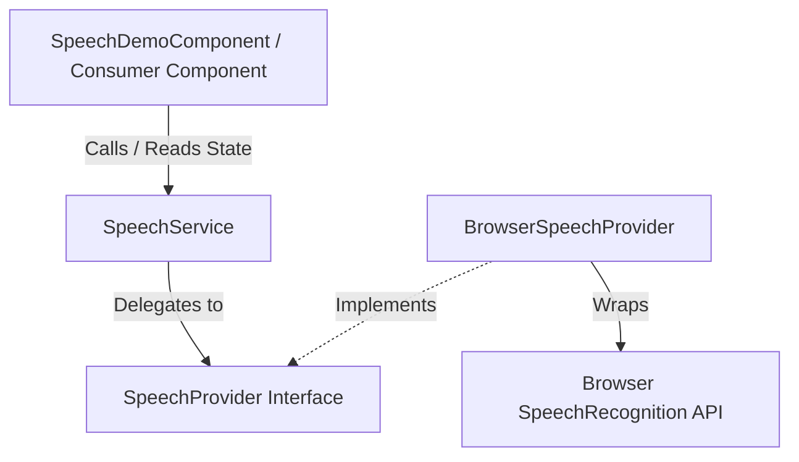

# Speech Recognition Module Implementation Plan

This plan outlines the architecture and implementation details for a production-quality, reusable **Speech Recognition Module** built for Angular 22 and TypeScript 6.

## Architecture Layering

The module will be designed with a decoupled, provider-based architecture:


This layered approach guarantees that the core service and components remain agnostic of the actual speech recognition implementation (e.g. Chrome's Web Speech API vs. future integrations like Whisper or Google Cloud Speech-to-Text).

---

## Proposed Changes

We will introduce the following files under [src/app/core/speech](file:///Users/smitpatel/Desktop/Personal%20Projects/voice-to-text/src/app/core/speech):

### 1. Types & Models Layer

We will define strongly typed representations of the state, status, and error states.

#### [NEW] [speech-status.type.ts](file:///Users/smitpatel/Desktop/Personal%20Projects/voice-to-text/src/app/core/speech/types/speech-status.type.ts)
Holds status string literal types for the speech lifecycle.
- `'idle'`: Ready to start.
- `'listening'`: Microphone is active, capturing speech.
- `'processing'`: Active speech ended, processing the last results.
- `'error'`: An error occurred.

#### [NEW] [speech-error-code.type.ts](file:///Users/smitpatel/Desktop/Personal%20Projects/voice-to-text/src/app/core/speech/types/speech-error-code.type.ts)
A strongly typed set of standard error codes that abstracts browser-specific error strings.
- `'no-speech'`, `'aborted'`, `'audio-capture'`, `'network'`, `'not-allowed'`, `'service-not-allowed'`, `'bad-grammar'`, `'language-not-supported'`, `'not-supported'`, `'unknown'`.

#### [NEW] [speech-state.model.ts](file:///Users/smitpatel/Desktop/Personal%20Projects/voice-to-text/src/app/core/speech/models/speech-state.model.ts)
The overall state object of the speech module.
```typescript
import { SpeechStatus } from '../types/speech-status.type';
import { SpeechErrorCode } from '../types/speech-error-code.type';

export interface SpeechState {
  readonly status: SpeechStatus;
  readonly transcript: string; // Combined intermediate + final transcript
  readonly finalTranscript: string; // Verified final text
  readonly confidence: number; // Recognition confidence value (0 to 1)
  readonly language: string; // E.g., 'en-US', 'es-ES'
  readonly error: SpeechErrorCode | null;
  readonly errorMessage: string | null; // User-friendly localized error message
}
```

---

### 2. Speech Provider Layer

Provides the abstraction over the Speech Recognition API.

#### [NEW] [speech-provider.interface.ts](file:///Users/smitpatel/Desktop/Personal%20Projects/voice-to-text/src/app/core/speech/providers/speech-provider.interface.ts)
The interface all speech recognition implementations must satisfy.
```typescript
import { Observable } from 'rxjs';
import { SpeechState } from '../models/speech-state.model';

export interface SpeechProvider {
  initialize(): void;
  start(): void;
  stop(): void;
  abort(): void;
  setLanguage(lang: string): void;
  isSupported(): boolean;
  readonly state$: Observable<Partial<SpeechState>>;
}
```

#### [NEW] [speech-provider.token.ts](file:///Users/smitpatel/Desktop/Personal%20Projects/voice-to-text/src/app/core/speech/providers/speech-provider.token.ts)
An `InjectionToken` for injecting the provider dynamically.
```typescript
import { InjectionToken } from '@angular/core';
import { SpeechProvider } from './speech-provider.interface';

export const SPEECH_PROVIDER = new InjectionToken<SpeechProvider>('SPEECH_PROVIDER');
```

#### [NEW] [browser-speech-provider.service.ts](file:///Users/smitpatel/Desktop/Personal%20Projects/voice-to-text/src/app/core/speech/providers/browser-speech-provider.service.ts)
*CLI Command:* `ng generate service core/speech/providers/browser-speech-provider`
Implements the Web Speech API (`SpeechRecognition` / `webkitSpeechRecognition`).
- It will wrap browser window SpeechRecognition objects safely.
- Maps `onstart`, `onresult`, `onerror`, `onend` to push partial updates to an internal `Subject` exposed as `state$`.
- Safely references `window` (checking `typeof window !== 'undefined'`) to prevent server-side compilation issues (for future SSR).

---

### 3. Speech Service Layer

Exposes clean APIs and signals to the application.

#### [NEW] [speech.service.ts](file:///Users/smitpatel/Desktop/Personal%20Projects/voice-to-text/src/app/core/speech/services/speech.service.ts)
*CLI Command:* `ng generate service core/speech/services/speech`
Uses the new Angular 22 `@Service` decorator.
- Injects the `SPEECH_PROVIDER`.
- Exposes a read-only Signal: `readonly state = this.stateSignal.asReadonly()`.
- Updates this signal reactively by subscribing to `provider.state$` inside its constructor, cleaning up via Angular 22 `DestroyRef`.
- Provides methods: `start()`, `stop()`, `abort()`, `reset()`, `setLanguage(lang: string)`.

---

### 4. UI Layer

#### [NEW] [speech-demo.component.ts](file:///Users/smitpatel/Desktop/Personal%20Projects/voice-to-text/src/app/core/speech/components/speech-demo/speech-demo.component.ts)
*CLI Command:* `ng generate component core/speech/components/speech-demo`
Allows live interaction with the module.
- Displays browser support, current status, live transcript, final transcript, confidence score, and error details.
- Controls to start, stop, and reset the state.
- Form control (native or Signal form) or drop-down to switch language (e.g. English, Spanish, Hindi).

---

## Verification Plan

### Automated Tests
We will add unit tests for:
- **`BrowserSpeechProvider`**: Mocking the browser's global `webkitSpeechRecognition` to verify state transitions and event mappings.
- **`SpeechService`**: Verifying that calling start/stop delegating to the provider updates the state signal accordingly.
- **`SpeechDemoComponent`**: Testing that buttons are disabled/enabled appropriately based on the speech status and trigger corresponding service functions.

Test Execution:
```bash
npm run test
```

### Manual Verification
1. Open the Angular dev server:
   ```bash
   npm run start
   ```
2. Interact with the `SpeechDemoComponent` inside Chrome to test start/stop, speech transcription, language changes, and denied permission error states.
