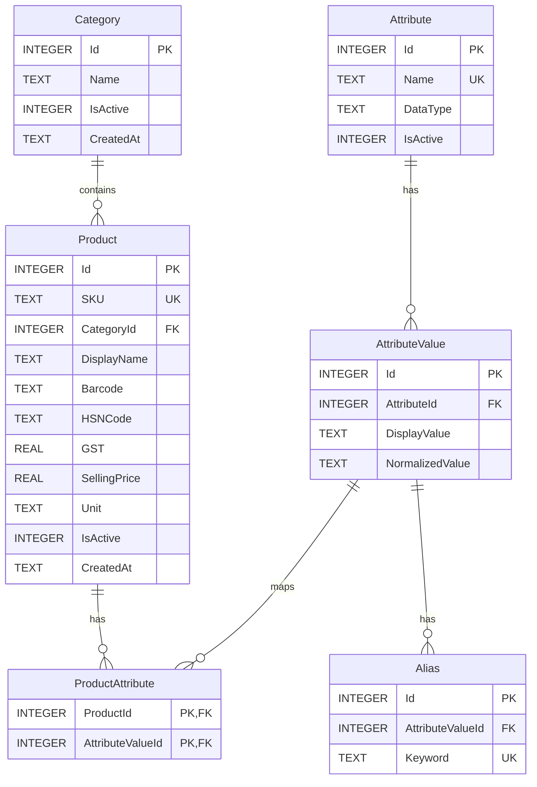

# SQLite Data Layer Implementation Plan (Phase 1)

This plan details the implementation of a clean, decoupled SQLite data layer for the **Hardware & Paints Billing Application** using Angular 22, Capacitor, and `@capacitor-community/sqlite`.

## Layered Architecture Diagram

```mermaid
graph TD
    A[Consumer Components] -->|Calls| B[Repositories]
    B -->|Query Methods| C[DatabaseService]
    C -->|Executes SQLite Statements| D[@capacitor-community/sqlite]
```

To ensure strict separation of concerns, components will never execute SQL directly. All data access goes through dedicated repository classes, which utilize the `DatabaseService` to execute SQL and manage transactions.

---

## Technical Stack & Dependencies

We will install:
- `@capacitor/core`: Core Capacitor plugin libraries.
- `@capacitor-community/sqlite`: Cross-platform SQLite driver.

---

## Directory Structure

We will create the following structure under [src/app/core/database](file:///Users/smitpatel/Desktop/Personal%20Projects/voice-to-text/src/app/core/database):

```
src/app/core/database/
  ├── models/
  │    ├── category.model.ts
  │    ├── product.model.ts
  │    ├── attribute.model.ts
  │    ├── attribute-value.model.ts
  │    ├── product-attribute.model.ts
  │    └── alias.model.ts
  ├── types/
  │    └── database.types.ts
  ├── migrations/
  │    └── migration-v1.ts
  ├── seed/
  │    └── seed-v1.ts
  ├── repositories/
  │    ├── category.repository.ts
  │    ├── product.repository.ts
  │    ├── attribute.repository.ts
  │    └── alias.repository.ts
  ├── database.constants.ts
  └── database.service.ts
```

---

## Database Schema (Version 1)

The v1 schema will consist of six tables with foreign key constraints to model relational categories, products, attributes, values, and search aliases:



---

## Proposed Changes

### 1. Model Definitions

#### [NEW] [category.model.ts](file:///Users/smitpatel/Desktop/Personal%20Projects/voice-to-text/src/app/core/database/models/category.model.ts)
Represents a product category (e.g. Plumbing).

#### [NEW] [product.model.ts](file:///Users/smitpatel/Desktop/Personal%20Projects/voice-to-text/src/app/core/database/models/product.model.ts)
Represents a sellable item with pricing, SKU, unit, and category mappings.

#### [NEW] [attribute.model.ts](file:///Users/smitpatel/Desktop/Personal%20Projects/voice-to-text/src/app/core/database/models/attribute.model.ts)
Defines characteristics like 'Brand', 'Material', 'Size'.

#### [NEW] [attribute-value.model.ts](file:///Users/smitpatel/Desktop/Personal%20Projects/voice-to-text/src/app/core/database/models/attribute-value.model.ts)
Concrete options for attributes (e.g., 'Supreme' for Brand, 'PVC' for Material).

#### [NEW] [product-attribute.model.ts](file:///Users/smitpatel/Desktop/Personal%20Projects/voice-to-text/src/app/core/database/models/product-attribute.model.ts)
Junction structure mapping products to attribute values.

#### [NEW] [alias.model.ts](file:///Users/smitpatel/Desktop/Personal%20Projects/voice-to-text/src/app/core/database/models/alias.model.ts)
Search keyword mapping (including multilingual English/Gujarati) linked to attribute values.

---

### 2. Core Service & Engine

#### [NEW] [database.types.ts](file:///Users/smitpatel/Desktop/Personal%20Projects/voice-to-text/src/app/core/database/types/database.types.ts)
Contains structural types for migrations, seed interfaces, and query response mappings.

#### [NEW] [database.constants.ts](file:///Users/smitpatel/Desktop/Personal%20Projects/voice-to-text/src/app/core/database/database.constants.ts)
Constants for db name, configuration, and default tags.

#### [NEW] [migration-v1.ts](file:///Users/smitpatel/Desktop/Personal%20Projects/voice-to-text/src/app/core/database/migrations/migration-v1.ts)
SQL array containing V1 DDL instructions (table creations, default indexes).

#### [NEW] [seed-v1.ts](file:///Users/smitpatel/Desktop/Personal%20Projects/voice-to-text/src/app/core/database/seed/seed-v1.ts)
SQL statements inserting plumbing categories, attributes (Brand, Material, Size, Pressure, Quality), values, products, and English/Gujarati aliases.

#### [NEW] [database.service.ts](file:///Users/smitpatel/Desktop/Personal%20Projects/voice-to-text/src/app/core/database/database.service.ts)
*CLI Command:* `ng generate service core/database/database`
- Opens and retains connection to the SQLite database.
- Checks `user_version` of the database.
- Executes migrations sequentially up to version 1.
- Supports generic helper functions: `execute()`, `query()`, `run()`, and `runTransaction()`.
- Implements a seeding flag so seed script only runs on clean creation.

---

### 3. Repository Layer

Each repository exposes CRUD interfaces utilizing the central `DatabaseService`.

#### [NEW] [category.repository.ts](file:///Users/smitpatel/Desktop/Personal%20Projects/voice-to-text/src/app/core/database/repositories/category.repository.ts)
Implements categories insertion, list retrieval, active checks.

#### [NEW] [product.repository.ts](file:///Users/smitpatel/Desktop/Personal%20Projects/voice-to-text/src/app/core/database/repositories/product.repository.ts)
Inserts products, updates prices, retrieves individual records by SKU/ID, and performs multi-table joins to retrieve full Product configurations (along with mapped attributes).

#### [NEW] [attribute.repository.ts](file:///Users/smitpatel/Desktop/Personal%20Projects/voice-to-text/src/app/core/database/repositories/attribute.repository.ts)
Queries attributes and attribute values.

#### [NEW] [alias.repository.ts](file:///Users/smitpatel/Desktop/Personal%20Projects/voice-to-text/src/app/core/database/repositories/alias.repository.ts)
Inserts and queries aliases by search keywords.

---

## Verification Plan

### Automated Unit Tests
We will write Vitest unit tests to assert correct database service behavior, including:
- Checking connection open state.
- Simulating migrations execution.
- Verifying database helper functions proxy correctly.
- Testing repository CRUD operations by using a mocked SQLite connection.

### Manual verification
We will create a simple validation spec or test block that runs at application start, initializing the database, checking migrations, reading seeded products and categories, and logging output to verify structural and data integrity.
